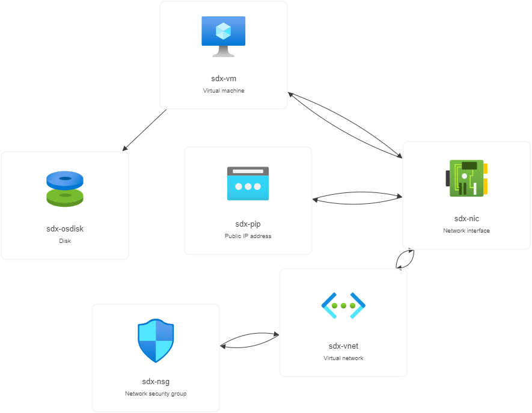

# SaDx Terraform Project
Terrafom versiyonu: Terraform v1.12.2


## Build-Step Notları

1. `terraform.tfvars dosyanı editle`
2. `az login`  
3. `az account show` (bilgilerini görüntüle)  
4. Yukarıdaki bilgileri kullanarak aşağıdaki komutu doldur.
```bash
$env:ARM_SUBSCRIPTION_ID="xxxxxxxx-xxxx-xxxx-xxxx-xxxxxxxxxxxx"
$env:ARM_TENANT_ID="yyyyyyyy-yyyy-yyyy-yyyy-yyyyyyyyyyyy"
```
5. Terraform dosyanı initialize et
```bash
terraform init
```
6. Uygulanacak değişiklikleri planla, gözden geçir.
```bash
terraform plan
```
7. Planlanmış değişiklikleri uygula, karşına onay kısmı çıkacak "yes" yaz.
```bash
terraform apply
```
8. Azure portaldan ve gelen output linkinden kontrollerini yaptıktan sonra resourceları sil (yes yaz).
```bash
terraform destroy
```
---

## 1. Terraform init, terraform plan, terraform apply komutları nedir neden kullanılırlar?

Terraform init --> Projeyi başlatır, Provider (Azure, Aws, Google Cloud) eklentilerini indirir, Backend operasyonlarını başlatır  
Terraform plan --> Güncel terraform dosyasından nelerin değiştiğini ön izlemek için kullanılır.  
Terraform apply --> Önizlenmiş değişiklikleri uygulamaya koyar  

---

## 2. Terraform fmt, terraform validate ve terraform refresh komutlarının işlevleri nelerdir?

Terraform fmt --> Düzenleme sağlıyor kod tek tip kurallarla format olarak tek tip hale gelmiş oluyor.  
Terraform validate --> Değerlerin yazımsal olarak doğruluğunu kontrol ediyor ama gerçekten bulutta var olup olamayacağını (değerlerin anlamlı olup olmadığını) kontrol etmiyor. İstisnai olarak bazı değerlerin var olup olmayacağını biliyor düzeltme istiyor.  
Terraform refresh --> Terraformu kullanmadan azure portal üzerinden yapılan değişiklikleri terraformun görebilmesi için terraform state dosyasını günceller. Senkronizasyon için önemlidir.  

---

## 3. main.tf, variables.tf ve outputs.tf dosyaları ne işe yarar?

main.tf --> Ana tercihlerin belirlendiği yer infrastructre'ın kurulduğu yerdir.  
variables.tf --> Burada variableları tutarız bunun sebebi de tekrarlı kullanılacak belirlenmiş variableları tek yerden değiştirebilmek kolayca tek yerden tercihlerimizi düzenleyebilmek örn: subscription_id = sub_id yaptığında aynı template'i başka hesapta da kullanmak için variables kısmında sub_id = "xxxxxxx" veya sub_id = "yyyyyyy" yaparak hesaplar arasında template'ini kullanabilirsin.  
outputs.tf --> terraform apply yaptıktan sonra karşına çıkacak değerleri belirlediğin yer örn: vm kaldırdın outputs kısmına ip'sini eklersen apply'dan sonra sana çıktısını verecektir. ip = xxxxxxx  

---

## 4. HCL nedir ve nasıl bir yazımı vardır?

Daha okunabilir JSON a benzeyen bir listeleme dili. Cloud infrastructure'ını bir arada görüntüleyebileceğimiz ve detaylı bir şekilde oluşturabildiğimiz bir yapısı var. Template oluşturmak ve otomasyon açısından artı sağlıyor. 

---

## 5. Terraform’da bir resource bloğu nasıl yazılır ve hangi bileşenleri içerir?

Resource bloğu hangi kaynağı yazacak isek ona göre göre tanımlanır. Örn: resource "azurerm_virtual_network" "vnet" şeklinde ilk kısım kullanılacak servisin clouddaki adı iken ikinci bizim lokal makinemizde servise verdiğimiz addır. Devamında içine name, location, resource_group_name, properties gibi değerler belirtilir. 

---

## 6. Modül yapısı nedir, ne zaman ve neden kullanılır?

Modül yapısı farklı terraform modüllerini (main.tf, variables.tf, outputs.tf dan oluşan yapılar) ayrı ayrı saklamak ve onları ayrı ayrı kullanmak için kullanılan yapıdır. Örn bu projede vm farklı bir modülde saklanıp root tan çağırılabilirdi proje küçük olduğu için gereksiz. 

---

## 7. Terraform’da provider nedir?

Servis sağlayıcısının kim olduğunu tanımladığımız alandır. Kendi bloğu vardır bağlantı için subscription id'yi içine alır kısaca servis sağlayıcımıza bağlanmamız için oluşturduğumuz bloktur.

---

## 8. Terraform state dosyası (terraform.tfstate) nedir ve neden önemlidir?

State dosyası clouddaki yapının lokal makinemizde tanınması için sürekli güncellenen dosyadır. Cloudda manuel yapılan değişiklikler state dosyasına işlenmelidir bunun için terraform refresh kullanıır. Apply öncesi zaten auto refresh yapılır.

---

## 9. variables.tf ve terraform.tfvars dosyalarının farkı nedir?

variables main.tf de kullanılacak değişkenlerin tanımlaması için kullanılır. Default değer description ve değişken adını bu dosyada belirleriz. terraform.tfvars ise bu değişkenlerin hangi değerleri olduğunu belirler örn: subscription_id tfars da tutulur çünkü kişiseldir aynı zamanda variables.tf da da bunun bir değişkeni vardır ama value su yoktur. terraform.tfvars paylaşılamamalıdır (kişisel bilgiler içermesi sebebi ile)

---

## 10. VNet, Subnet, NSG nedir?

Vnet altyapının kurulacağı yeri oluşturur cloud üzerinde bunun içinde bir veya birden fazla subnetler tanımlanır bu subnetler nsg a bağlanır ve subnet koruması sağlanır subnete vmler ve başka komponentler bağlanır bu bağlı olan komponentler nsg sayesinde korunur vm de hepsine bağlanır en üst çatıdır.

---

## 11. Public ve Private IP nedir?

Private ip oluşturulan subnet içerisindeki elemanların iletişimi için vardır. Public ip ise dış dünya iletişimi için gereklidir ayrıca tanımlama yapılır ve nic e bağlanır private gibi otomatik olarak oluşturulmaz.

---

## 12. NSG’nin doğrudan sanal makineye değil, subnet’e atanması ne anlama gelir?

Inbound ve outbound trafiğinin subnetin içinde yaşayan ona bağlı tüm elemanlar için geçerli olması anlamına gelir. Direkt vm'e bağlı olmak yerine subnetteki diğer elemanlar da aynı kurallarla korunur bazı senaryolarda vm'e direkt nsg bağlamak da bi opsiyon olabilir.

---


## Yaşadığım Sorunlar ve Çözümler

1. Azure Policy hatası: Yalnızca belirli bölgelerde kaynak oluşturulmasına izin verilmişti. Terraform apply sırasında `403` hatası aldım. Çözüm: location değerini `"polandcentral"` olarak değiştirdim.

2. SSH bağlanırken “UNPROTECTED PRIVATE KEY FILE” uyarısı: .ssh/id_rsa dosyamın izinleri çok açıktı (Windows varsayılan olarak dosyayı fazla erişime açık oluşturmuştu). Çözüm: chmod 600 ~/.ssh/id_rsa komutu ile sadece kullanıcıya özel erişim verdim, sorun düzeldi.

